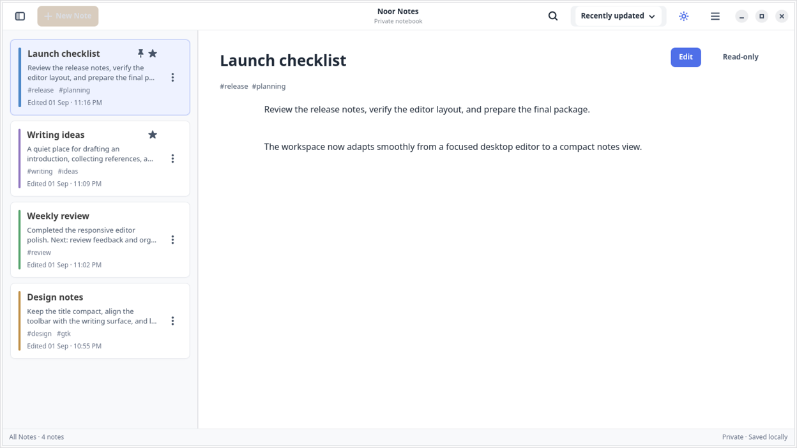
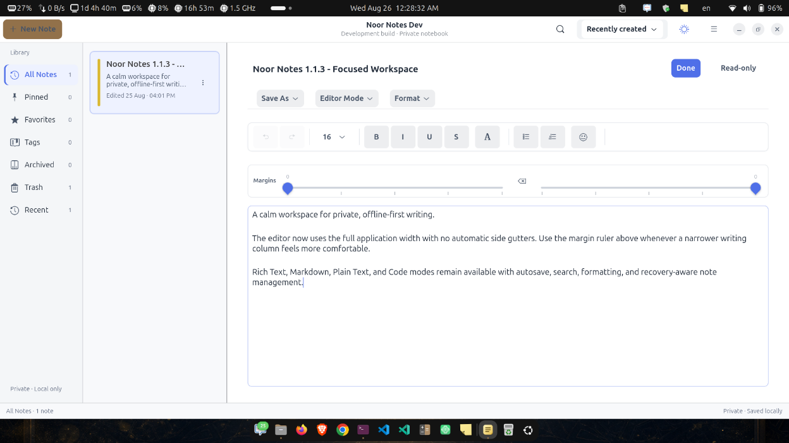
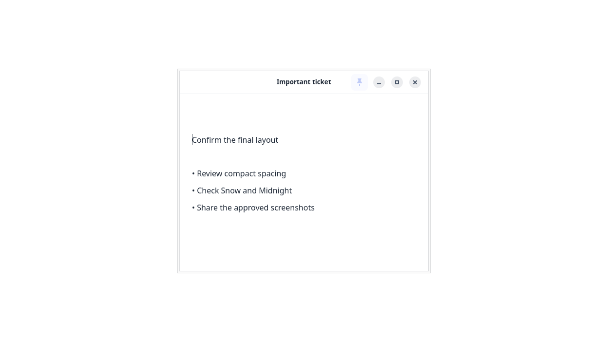
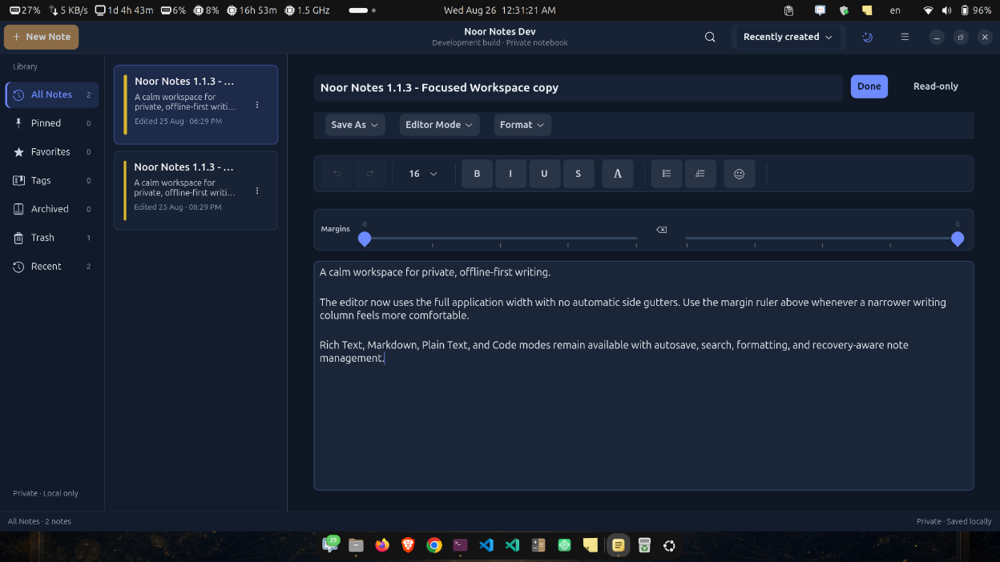

# Noor Notes

Noor Notes is a privacy-first, offline-first GTK4/libadwaita notes application for Linux. It combines a fast sticky-note workflow with a modern library, focused rich/source editors, encrypted local storage, recovery-aware autosave, Linux packaging, and automated verification.

**Current source:** v1.1.3 · **Current release:** v1.1.3 · **Stable:** v1.1.3 (revision 19) · **Edge:** v1.1.3 (revision 22) · **GitHub release:** v1.1.1 · **Platform:** Linux · **License:** GPL-3.0-or-later

## Product overview

Noor Notes is both a usable desktop application and evidence of production-oriented Linux engineering. The repository demonstrates native GTK interface work, a multi-crate Rust architecture, SQLCipher storage, GNOME Keyring integration, safe migration and recovery paths, cross-environment window handling, packaging, accessibility work, and a broad automated test suite.

The refreshed library uses distinct sidebar, note-list, and editor surfaces; note colours remain visible as restrained identity rails and subtle tints instead of saturated cards. Compact controls, a readable preview column, and adaptive narrow-window navigation keep the workspace calm and usable across window sizes.

The current release gallery below shows the real v1.1.3 Dev build with synthetic demonstration notes. It covers the expanded editor workspace, read-only preview, and the maintained Snow and Midnight appearances.

| Library and preview | Focused rich editor |
| --- | --- |
|  |  |

| Sticky read-only window | Midnight appearance |
| --- | --- |
|  |  |

## Recent fixes

- Expanded the integrated editor background, header, menu, toolbar, and writing surface across the available workspace with no automatic side gutters.
- Refined the sticky read-only window with compact header spacing, balanced 10–12-pixel normal padding, 4–6-pixel compact padding, and a larger distraction-free reading area.
- Added an accessible Google Docs-style margin ruler: editing starts at the native canvas padding, left and right controls add temporary margins, Reset returns both to zero, and selecting another note clears the session-only margin choice without changing stored note data.
- Reapplied adaptive pane allocation from the native GDK surface layout signal, so restored and manually resized windows collapse navigation at the correct breakpoint without polling or blocking the UI thread.
- Prevented the confined GTK focus use-after-free that closed the Live Snap after Archive, Restore, or Move to Trash: note-action popovers now settle before mutation, and focus moves to stable Library navigation before recyclable note cards refresh.
- Removed the incompatible bundled GTK 4.14 runtime and use the GNOME content snap's matching GTK/libadwaita stack.
- Added an artifact-level Snap runtime contract that blocks future releases containing duplicate GTK, libadwaita, or GtkSourceView runtimes while retaining the required libspelling library.
- Fixed missing sidebar, toolbar, menu, formatting, and status icons in confined installs whose selected desktop icon theme is unavailable inside the Snap; Noor Notes now preserves complete themes and otherwise uses a process-local Adwaita fallback.
- Fixed the library preview allocation so wide windows keep a readable document column instead of collapsing text into a narrow vertical strip.
- Preserved the responsive list-to-preview transition at narrow widths without clipping the selected note or forcing horizontal scrolling.
- Fixed inline preview edits so finishing an edit and switching notes uses the existing autosave pipeline and retains the saved content.
- Refined Snow hierarchy, selected-note contrast, compact sidebar and note-list widths, editor spacing, and Midnight fallbacks.
- Added automatic Snap versions: changed weekly/manual edge builds increment patch, manual hotfix builds increment the current stable patch, and monthly/manual stable builds increment minor and reset patch before Store smoke testing and promotion.
- Kept Rich Text canvas spacing at 5 pixels vertically and 8 pixels horizontally.

## Engineering highlights

- Workspace boundaries separate the GTK application from domain, crypto, storage, synchronization, windowing, and Xpad-import concerns.
- Security-sensitive behavior fails closed: missing encryption keys and failed plaintext migrations never silently fall back to unencrypted storage.
- Autosave, close-time flushing, import/export, recovery, trash, rich formatting, source modes, appearance, and window behavior have focused integration coverage.
- Snap Store, downloadable Snap, Flatpak, local, and Ubuntu installation paths are documented with their supported channels and sandbox limitations.
- Known sandbox, Wayland, encrypted-sync, recovery, and release limitations remain explicit below.

## Features

- **Private writing assistance**: spelling, offline English grammar, and learned local predictions are enabled by default. Spelling uses installed system dictionaries; predictions learn only from Active and Archived note bodies stored in the encrypted database, never Trash.
- **Optional online assistance**: an OpenAI-compatible provider is opt-in and disabled until its connection is validated. Grammar sends only the current paragraph (maximum 2,000 Unicode characters), prediction sends only a nearby sentence (maximum 800), and the API key stays in GNOME Keyring. Titles, tags, other notes, account data, and encryption material are not sent.
- **Native notes library**: a compact GNOME header, adaptive navigation sidebar, virtualized note cards, selected-note preview, responsive empty states, keyboard navigation, and views for All Notes, Pinned, Favorites, Recent, Archived, Trash, and Tags.
- **Fast organization**: Unicode-aware debounced search, stable sorting, editable titles, searchable tags, pinned and favorite states, note colours, duplication, archive, restore, and confirmed permanent deletion.
- **Focused editor**: a full-width writing canvas with a compact toolbar, session-only margin ruler, and live status bar. Rich Text starts with the intentionally compact 5-pixel top/bottom and 8-pixel left/right canvas padding; the ruler can add temporary left and right margins without changing note content or persistence. Find and replace, undo and redo, word wrap, zoom, go to line, full screen, line and column position, word and character counts, and keyboard shortcuts work end to end.
- **Rich and source modes**: rich notes support persistent bold, italic, underline, strikethrough, lists, alignment, font sizes, text and highlight colours, and emoji. Markdown and code notes use GtkSourceView syntax languages, while Plain Text stays unhighlighted; all source modes include line numbers, current-line highlighting, regex search, bookmarks, and theme-matched editor palettes.
- **Reliable saving**: debounced autosave exposes Unsaved, Saving, Saved, and retryable failure states; close-time flushing protects pending edits, and rich formatting survives save and reopen.
- **Polished appearance**: Snow provides calm daytime surfaces, restrained note-colour accents, and subtle selection states; Midnight provides a purpose-built dark palette. System appearance resolves to one of those two maintained themes. The selection persists and updates library windows, editors, paper colours, controls, and symbolic icon colours together.
- **Private local storage**: SQLCipher encrypts note text, titles, tags, and history with a random key held by GNOME Keyring. Existing databases migrate safely, and Noor Notes adds no analytics, advertising, or tracking.
- **Optional encrypted account sync**: configured builds expose email sign-up, email sign-in, and Google sign-in from **Account & Sync…**. A separate vault passphrase creates a random end-to-end encryption key, a one-time recovery key can unlock another device, and manual sync uploads only authenticated ciphertext to owner-isolated Supabase rows. Offline edits remain local and retryable.
- **Optional encrypted Drive backups**: Google Drive App Data and OneDrive App Folder can hold current and timestamped recovery archives. Each provider is authorized separately with OAuth PKCE and its least-privilege app-folder scope; backup title, body, tags, formatting, and vault keys are encrypted before HTTP upload. Restore authenticates and previews the archive, asks for confirmation, and merges through the note repository instead of replacing the database.
- **Linux desktop integration**: source installs can preview and import Xpad notes without modifying the originals. Always on Top, all-workspaces, opacity, and other window controls are available where the active desktop backend supports them.

### Writing assistance and privacy

Open **Writing Assistance…** from the main menu to choose installed spelling dictionaries, offline English grammar, learned local predictions, or an optional provider. Local features start enabled; online AI starts disabled and cannot be enabled until **Test Connection** succeeds. Each note can inherit these choices or override all four from its More menu. View Only and Trash suppress assistance. In Code mode, checks and predictions are restricted to comments and strings.

Prediction controls are keyboard accessible: **Tab** accepts visible ghost text, **Escape** dismisses it, and **Alt+Down** opens up to three alternatives; use **Up/Down** and **Enter** to choose one. Suggestions remain transient until accepted, so they are absent from autosave, export, search, character counts, and undo history.

## Installation

Choose one installation method:

- **Snap Store** for the recommended stable packaged installation.
- **Downloaded Snap or Flatpak release** for the latest locally verified GitHub package.
- **Ubuntu source installer** for the current repository version and host Xpad import.
- **Local rebuild** when this repository and its dependencies are already installed.

### Install from Snap Store

Install the stable Snap Store release, then launch it from the application grid or terminal:

The current stable release is **Noor Notes 1.1.3, revision 19** for amd64. Use `snap info noor-notes` to confirm the latest Store revision before installation.

The repository source is **1.1.3**. The last verified Store preview is **1.1.3, revision 22**; source and Store versions are verified independently before any future publication.
```bash
sudo snap install noor-notes
noor-notes
```

View the Store channels and confirm the installed revision:

```bash
snap info noor-notes
snap list noor-notes
```

Refresh an existing installation from the stable channel:

```bash
sudo snap refresh noor-notes --stable
```

#### Optional edge channel

The `latest/edge` channel is intended for preview testing and may update more frequently. Switch an existing installation to edge, or return it to stable, with:

```bash
sudo snap refresh noor-notes --edge
sudo snap refresh noor-notes --stable
```

Remove the Snap installation when it is no longer needed:

```bash
sudo snap remove noor-notes
```

See the [Noor Notes Snap Store listing](https://snapcraft.io/noor-notes) for the current version, revision, architecture, and channel information.

### Release packages

Download `noor-notes_1.1.1_amd64.snap` or `noor-notes.flatpak` from the v1.1.1 release, verify it as described below, then install one package.

```bash
sudo snap install --dangerous ./noor-notes_1.1.1_amd64.snap
```

On Ubuntu or another APT-based system, install Flatpak and add a runtime remote before installing the Flatpak bundle:

```bash
sudo apt install flatpak
flatpak --user remote-add --if-not-exists flathub https://flathub.org/repo/flathub.flatpakrepo
flatpak install --user ./noor-notes.flatpak
flatpak run io.github.saamaamr.NoorNotes
```

The Flatpak bundle needs Flatpak itself and a remote that can provide its GNOME 50 runtime; the command above adds Flathub only as that runtime remote, not as a Noor Notes installation source. The release Snap is strictly confined. The Flatpak exposes display integration, optional networking, and the desktop Secret Service; neither package has filesystem-wide access.

### Build from source on Ubuntu

For Ubuntu and other APT-based systems, clone the repository and run the installer:

```bash
git clone https://github.com/saamaamr/noor-notes.git
cd noor-notes
./scripts/install-ubuntu.sh
```

The Ubuntu installer installs required system packages, installs Rust only when it is missing, builds the source checkout as **Noor Notes Dev**, installs its separate desktop launcher and icon, and installs the optional GNOME Shell integration for the current user. The Dev app uses the distinct application ID `io.github.saamaamr.NoorNotes.Devel`, so it can run beside the Snap Store build without launcher or single-instance conflicts. Existing source-install notes remain at the same local data path.

From an existing checkout with dependencies already available, rebuild and reinstall with `./scripts/install-local.sh`. Launch **Noor Notes Dev** from the application grid or run `~/.local/bin/noor-notes-dev` directly (or the equivalent `XDG_BIN_HOME` location) to see startup diagnostics in a terminal. The installer retires the old source-only `noor-notes` launcher after the Dev launcher is installed; it never removes the notes database.

## Verify release artifacts

To download every published asset from a terminal:

```bash
release=https://github.com/saamaamr/noor-notes/releases/download/v1.1.1
curl -LO "$release/noor-notes_1.1.1_amd64.snap"
curl -LO "$release/noor-notes.flatpak"
curl -LO "$release/SHA256SUMS.txt"
sha256sum -c SHA256SUMS.txt
```

That command verifies both package files and each line must report `OK`. If you downloaded just one package through a browser, verify that selected artifact instead (replace the value with the Snap filename when appropriate):

```bash
artifact=noor-notes.flatpak
test "$(grep -Fc "  $artifact" SHA256SUMS.txt)" = 1
grep -F "  $artifact" SHA256SUMS.txt | sha256sum -c -
```

The final command must report `OK` for the selected artifact before installation.

## Editor modes

Choose **Editor mode** from the note More menu to switch between Rich Text, Markdown, Plain Text, and Code. Existing rich notes remain compatible. Noor Notes previews conversions before applying them and creates a recovery copy whenever rich styling would be lost.

Markdown, Plain Text, and Code use the source editor with optional line numbers, current-line highlighting, bookmarks, regular-expression search, word wrap, and zoom. Markdown and Code apply language-aware syntax highlighting; Plain Text intentionally uses one consistent body colour. Snow and Midnight each provide a dedicated high-contrast source palette that updates immediately in open editors. Rich Text retains persistent formatting and the compact formatting controls described below.

## Appearance

Use the appearance button in a library or editor header to switch quickly between Snow and Midnight. For a direct choice, open the main menu **Appearance** submenu. **Appearance Settings** presents the maintained Snow daytime theme and Midnight night theme with clear previews.

Historical Light, Warm Paper, and Cool Mist preferences migrate safely to Snow; Graphite and OLED migrate to Midnight. System follows the current GNOME preference by resolving to Snow or Midnight. Explicit selections persist across restarts and update every open library, editor, sticky note, popover, and settings window. Native symbolic icons adapt with the palette: neutral icons follow the foreground colour, active icons use the accent colour, and success, warning, and destructive icons retain accessible semantic colours.

## First use and Xpad import

Create a note from the library. With a native/source installation, use the Xpad import control, review the preview, and confirm the import. Noor Notes does not modify Xpad or its files under `~/.config/xpad`.

The strict Snap and Flatpak packages cannot read the host `~/.config/xpad`, so their import control cannot migrate host Xpad notes in v1.1.1. No portal or file-selection import path is provided in those packages; use a native/source installation for Xpad migration.

## Rich text, responsive controls, and Trash

Name a note from its title field or Rename action. Add comma-separated tags below the title and choose a note colour from Window Settings. Use the compact formatting toolbar to style selected text or insert an emoji. Repeated list-button clicks toggle the list instead of duplicating markers, and Enter continues or exits lists naturally. Preset sizes and a custom positive whole-number pixel size are available. Formatting is saved with the note; if a stored rich-text format is unsupported, Noor Notes safely displays its plain text instead.

In **Rich Text** mode, the formatting popover provides seven professional text-colour presets, seven highlight presets, Automatic/No Highlight reset controls, and native custom colour pickers. Preset colours adapt for Snow and Midnight, while custom RGB colours remain exact. Text and highlight colours persist through autosave, close, database reopen, export-compatible rich snapshots, and later theme changes. These controls are intentionally disabled in Markdown, Plain Text, and Code modes so source-editor syntax colours are never mixed with rich formatting.

The editor toolbar adapts to the note window: it stays on one compact row when space permits and automatically wraps into additional rows in narrow windows, keeping the **More note actions** (`⋮`) control visible and clickable. In short windows, the More menu limits each column to six action rows and continues the remaining actions in additional columns. **View Only** is available directly in this main More menu rather than behind a second submenu.

Use the grouped editor controls or these shortcuts:

- **Ctrl+F** — find in the current note
- **Ctrl+H** — open find and replace
- **Ctrl+G** — go to line
- **Ctrl++**, **Ctrl+-**, **Ctrl+0** — zoom in, out, or reset
- **Ctrl+Z**, **Ctrl+Shift+Z**, or **Ctrl+Y** — undo or redo
- **Ctrl+B**, **Ctrl+I**, **Ctrl+U** — bold, italic, or underline
- **F11** — enter or leave full screen
- **Escape** — close the active find panel

Export from the More menu as UTF-8 plain text or Markdown. Open the keyboard-shortcuts reference from the main-window application menu.

Move an active or archived note to Trash from the visible editor-header trash button, the editor More menu, or the note card action menu (including right-click). Noor Notes confirms the action and keeps the note recoverable in Trash. In Trash, restore the note or choose **Permanently Delete** and confirm; permanent deletion removes the note and its local history.

Archive an active note from the visible folder button in the editor header or on the currently selected library card. The same reversible action remains available in the note action menu. Noor Notes saves pending editor changes before moving the note, refreshes the library and sidebar counts, and keeps Archive controls hidden for notes already in Archived or Trash.

Choose **View Only** from the editor More menu for a minimal reading window containing only native window controls and the formatted note body. Text remains selectable and copyable, but editing controls are hidden. View-Only Mode is remembered per note. Double-click the body or press **Escape** to return to Edit Mode.

## Window and sandbox limitations

On X11, Noor Notes uses native window-manager support. A source checkout can also install the included, narrowly scoped GNOME Shell extension. Sandboxed Snap and Flatpak packages do not install that extension or receive host Xpad-directory access. On GNOME Wayland, Always on Top can therefore remain unavailable unless it is installed separately outside the sandbox. Unsupported Wayland compositors keep note editing available while disabling unsupported window controls.

## Optional GNOME lock-screen motion

Source installations on GNOME Shell 50 can install the separate `noor-lockscreen-motion@saamaamr.github.io` companion extension. It adds a restrained one-time wallpaper fade and zoom, a short clock rise and fade, and a subtle ambient antique-gold glow to the existing Noor lock-screen artwork. It does not change the wallpaper quotation, clock format, password field, authentication flow, or the installed WACK lock-screen extension.

The companion follows GNOME accessibility and power preferences. Disabling system animations disables all motion; Power Saver keeps only the one-time wallpaper fade. It uses compositor property transitions rather than video or a JavaScript frame loop, and it removes its temporary glow and restores touched actors on unlock.

Install both repository-owned GNOME extensions for the current user with:

```bash
./scripts/install-gnome-extension.sh
```

Log out and back in once, then press **Super+L** to test it. The extension only adds motion; it does not enable or control automatic day/night theme switching. To troubleshoot without affecting Noor Notes window controls or WACK, disable only the motion companion:

```bash
gnome-extensions disable noor-lockscreen-motion@saamaamr.github.io
```

## Encrypted sync

Noor Notes implements optional end-to-end encrypted synchronization while keeping SQLCipher SQLite as the local source of truth. Email sign-up/sign-in and Google account sign-in use Supabase Auth. On first setup the app creates a random vault key, wraps it with a user-supplied passphrase, and displays an independent recovery key once. Note payloads are encrypted locally with XChaCha20-Poly1305 before upload; Supabase receives ciphertext plus the identifiers and timestamps needed for ordered synchronization. Downloads use the existing revision/conflict policy, and failed network cycles keep local editing available.

Development builds read these public application values at runtime or compile time:

    NOOR_SUPABASE_URL=https://YOUR_PROJECT.supabase.co
    NOOR_SUPABASE_PUBLISHABLE_KEY=sb_publishable_YOUR_PUBLIC_KEY

Only an HTTPS project URL and a Supabase publishable/anon client key are accepted; never provide a `service_role` or `sb_secret_` key. Enable email and Google providers in the Supabase dashboard and allow the exact redirect URL `http://127.0.0.1:43817/auth/callback`. Google sign-in requests authentication only, not Google Drive access. The app opens a loopback-only listener for one callback with a five-minute timeout and then closes it.

Apply the repository-owned migrations in `supabase/migrations/` before enabling a project. Their row-level-security policies bind encrypted vaults and note revisions to the authenticated user. No production Supabase URL or key is committed to this repository. Builds without them show a truthful local-only state and disable account actions. Account refresh tokens, wrapped vault material, and sync cursors are stored through GNOME Keyring; passwords, plaintext vault keys, and OAuth authorization codes are not persisted.

### Google Drive and OneDrive backup

Drive backup is optional and separate from Supabase synchronization. A configured build may include these public desktop-client IDs:

    NOOR_GOOGLE_DRIVE_CLIENT_ID=YOUR_GOOGLE_DESKTOP_CLIENT_ID
    NOOR_ONEDRIVE_CLIENT_ID=YOUR_ENTRA_PUBLIC_CLIENT_ID

Register these exact loopback redirects:

- Google Drive: `http://127.0.0.1:43818/backup/google`
- OneDrive: `http://127.0.0.1:43819/backup/onedrive`

Google requests exactly `https://www.googleapis.com/auth/drive.appdata`. OneDrive requests exactly `offline_access Files.ReadWrite.AppFolder`. Noor Notes is a public desktop client, so no client secret belongs in the binary, repository, Snap, or Flatpak. Provider refresh tokens use separate typed GNOME Keyring entries. Disconnect removes only that provider's local token and does not delete local notes, Supabase data, or another provider's token.

Each backup is a versioned, authenticated, maximum-128-MiB encrypted archive. **Backup Now** writes a timestamped recovery archive and replaces `current.nnbackup` inside the provider's app-owned area. **Restore Latest** lists available encrypted archives, decrypts and authenticates the selected latest archive locally, displays its note count and timestamp, and requires confirmation. Newer local revisions are preserved and equal-revision differences become conflict copies. The SQLCipher database file is never downloaded or replaced.

This repository does not contain live Supabase, Google Cloud, or Microsoft Entra credentials. Without reviewed client IDs, the related controls explicitly say **Not configured in this build**. Contract tests exercise the full HTTP, encryption, isolation, and restore behavior against local test servers; live provider validation still requires maintainer-owned projects and consent screens.

## Data and recovery

Back up the database only while Noor Notes is closed. Its location depends on how the app is installed:

- **Source/Dev install:** `${XDG_DATA_HOME:-~/.local/share}/noor-notes/notes.db`.
- **Flatpak:** `~/.var/app/io.github.saamaamr.NoorNotes/data/noor-notes/notes.db`.
- **Snap:** normally `~/snap/noor-notes/current/.local/share/noor-notes/notes.db`; the app's snap-scoped `HOME` maps to the revision-specific `SNAP_USER_DATA` directory.

Back up the encrypted database together with a working GNOME Keyring backup. If the local database key is lost, the ciphertext cannot be recovered. Plain-text and Markdown exports are intentionally unencrypted; protect or delete them separately.

## Troubleshooting

- If a release package will not install, re-download it and `SHA256SUMS.txt`, then use the selected-artifact checksum commands above. Confirm that the exact package reports `OK`.
- If Always on Top is disabled on GNOME Wayland, use a source installation with the separately installed GNOME Shell extension, or use a supported window environment.
- If lock-screen motion is missing after a source update, run `./scripts/install-gnome-extension.sh`, log out and back in, and confirm `gnome-extensions info noor-lockscreen-motion@saamaamr.github.io` reports the extension. The motion safely becomes a no-op if the compatible WACK/GNOME clock actors are unavailable.
- If Xpad import cannot find your existing notes from a Snap or Flatpak install, use a native/source installation: those sandboxes cannot read the host `~/.config/xpad` in v1.1.1.
- If **Account & Sync…** says cloud account support is unavailable, rebuild with the two public Supabase values above and apply the RLS migrations. If a Drive provider says it is not configured, register its exact redirect and rebuild with that provider's public client ID; never add a client secret.
- If source installation fails, run `./scripts/install-ubuntu.sh` on an APT-based system so the GTK4, Libadwaita, SQLite, OpenSSL, X11, and Secret Service dependencies are installed.
- After pulling source changes, run `./scripts/install-local.sh` to rebuild and replace the user-installed **Noor Notes Dev** binary and desktop resources. Before the first migration, fully quit any legacy source-installed Noor Notes process; on later updates, fully quit the older Dev process before reopening it.
- If Noor Notes Dev does not open from the application grid, run `~/.local/bin/noor-notes-dev` in a terminal and include the displayed error in a bug report. Reinstall first if that path is missing or older than the checkout. Do not delete the notes database or GNOME Keyring entry while diagnosing launch problems.
- If an Xpad note is skipped, inspect the import preview; it identifies entries that cannot be parsed before any import is committed.

## Development and build verification

Build a release binary with:

```bash
cargo build --release --package noor-notes
```

Before contributing a change, run:

```bash
cargo fmt --all -- --check
cargo clippy --workspace --all-targets --all-features -- -D warnings
cargo test --workspace
xvfb-run -a cargo test -p noor-notes --features development --test cli --test development_identity
cargo audit
cargo deny check
xvfb-run -a cargo test -p noor-windowing
gjs -m extensions/gnome/tests/test-policy.js
gjs -m extensions/lockscreen-motion/tests/test-policy.js
gjs -m extensions/lockscreen-motion/tests/test-actor-discovery.js
gjs -m extensions/lockscreen-motion/tests/test-session-state.js
gjs -m extensions/lockscreen-motion/tests/test-contract.js
bash tests/lockscreen_motion_install.sh
bash tests/e2e/two_device_sync.sh
```

## Release automation and Store status

Version tags build Snap and Flatpak artifacts in GitHub Actions. The `v1.1.1` tag creates the GitHub release with `noor-notes_1.1.1_amd64.snap`, `noor-notes.flatpak`, and `SHA256SUMS.txt` after the security gate passes. The exact validated tag Snap is published to `latest/edge` as soon as its independent artifact gates pass, installed back from the Store for a smoke test, and promoted without rebuilding to `latest/stable`; an unrelated Flatpak CDN outage cannot block that Snap hotfix path.

Every Monday at 12:00 Bangladesh time, the Snap cadence workflow publishes a new `main` revision to `latest/edge` only when the source commit changed. Each scheduled or manual edge publication reads the current Store edge version and increments its patch component, for example `1.0.0` to `1.0.1` and then `1.0.2`.

On the first Monday of each month, the workflow reads the current stable version, increments its minor component, and resets patch to zero, for example `1.0.0` to `1.1.0`. A manual hotfix instead increments only the current stable patch, for example `1.1.3` to `1.1.4`. The new version is built once, published to edge, installed back from the Store for a smoke test, and then promoted without rebuilding to `latest/stable`. Manual stable runs use the same minor-version policy. The generated version is synchronized across the Snap manifest, application binary, Cargo workspace packages, lockfile, and AppStream metadata inside the isolated CI build workspace. A maintainer can start an explicit edge, hotfix, or stable run from GitHub Actions. Publication requires a repository secret named `SNAPCRAFT_STORE_CREDENTIALS`, scoped to Noor Notes package push, update, and release access.

The stable channel is the recommended installation path. Edge receives more frequent previews and can be less tested; stable only receives a revision after the build, local package smoke test, and Store-installed edge smoke test succeed. A Flathub submission is not created by this project's workflow.

## Contributing

Contributions and bug reports are welcome. Open an [issue](https://github.com/saamaamr/noor-notes/issues) with reproduction details, and include relevant formatting, package, or workspace checks with a pull request.

## License

Noor Notes is licensed under [GPL-3.0-or-later](LICENSE).
