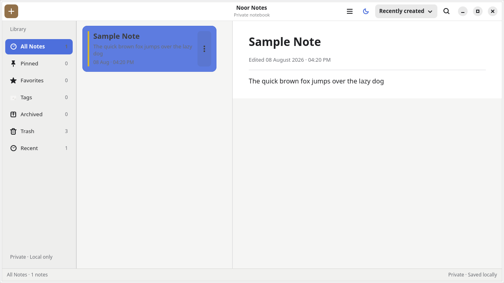
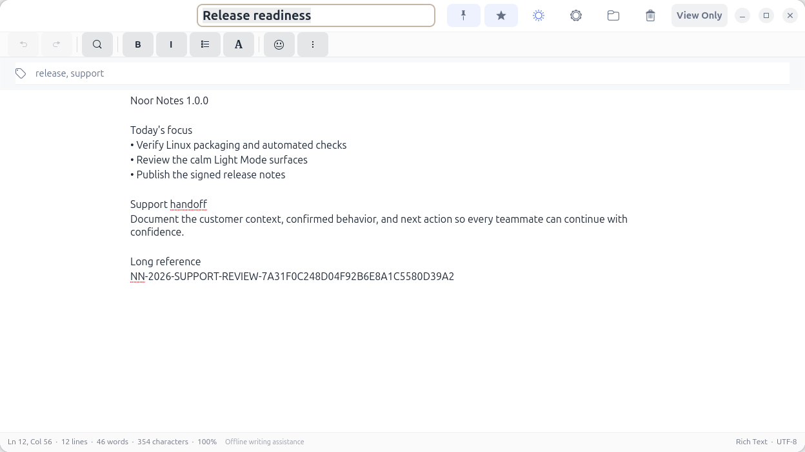
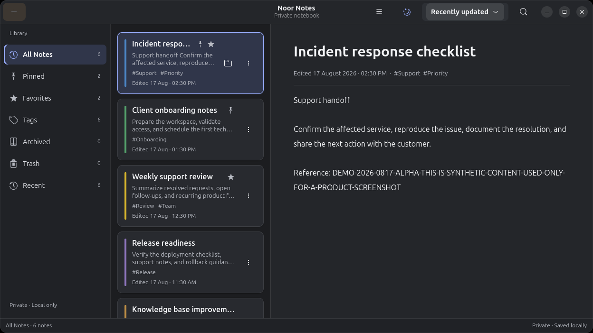
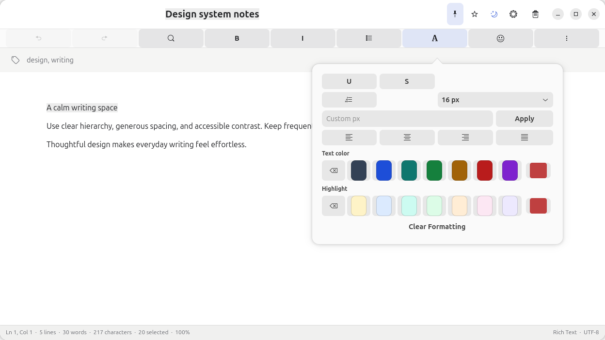
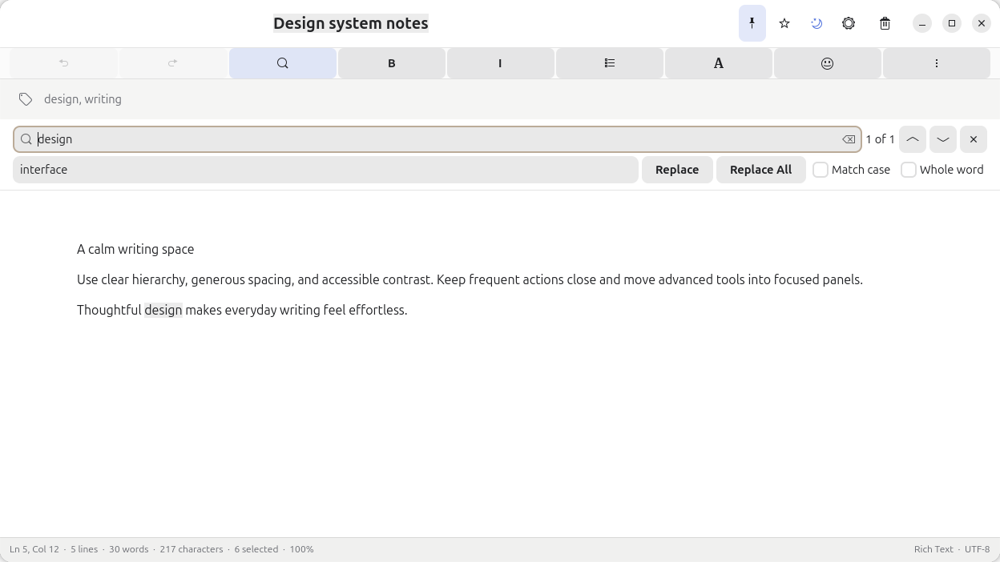
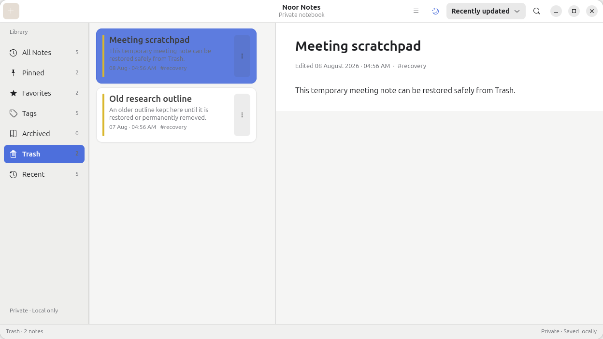
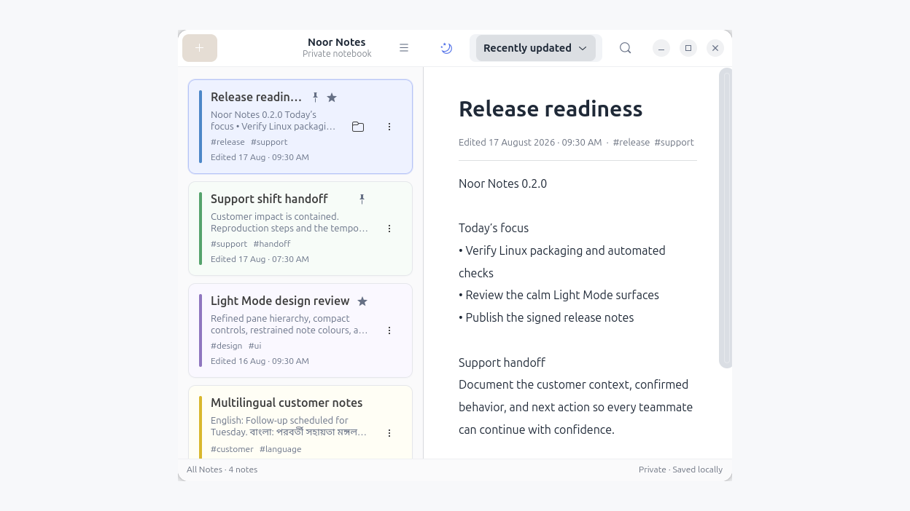

# Noor Notes

Noor Notes is a privacy-first, offline-first GTK4/libadwaita notes application for Linux. It combines a fast sticky-note workflow with a modern library, focused rich/source editors, encrypted local storage, recovery-aware autosave, Linux packaging, and automated verification.

**Current release:** v0.1.1 · **Platform:** Linux · **License:** GPL-3.0-or-later

## Product overview

Noor Notes is both a usable desktop application and evidence of production-oriented Linux engineering. The repository demonstrates native GTK interface work, a multi-crate Rust architecture, SQLCipher storage, GNOME Keyring integration, safe migration and recovery paths, cross-environment window handling, packaging, accessibility work, and a broad automated test suite.

Explore the [complete interface gallery](data/screenshots/INDEX.md) for maximized and compact layouts, editor modes, View-Only presentation, themes, menus, search, Trash, formatting, and settings.

| Library and preview | Focused rich editor |
| --- | --- |
|  |  |

| Dark appearance | Rich formatting and colours |
| --- | --- |
|  |  |

| Find and replace | Trash recovery | Narrow layout |
| --- | --- | --- |
|  |  |  |

## Engineering highlights

- Workspace boundaries separate the GTK application from domain, crypto, storage, synchronization, windowing, and Xpad-import concerns.
- Security-sensitive behavior fails closed: missing encryption keys and failed plaintext migrations never silently fall back to unencrypted storage.
- Autosave, close-time flushing, import/export, recovery, trash, rich formatting, source modes, appearance, and window behavior have focused integration coverage.
- Snap, Flatpak, local, and Ubuntu installation paths are documented without claiming unsupported store availability.
- Known sandbox, Wayland, encrypted-sync, recovery, and release limitations remain explicit below.

## Features

- **Native notes library**: a compact GNOME header, adaptive navigation sidebar, virtualized note cards, selected-note preview, responsive empty states, keyboard navigation, and views for All Notes, Pinned, Favorites, Recent, Archived, Trash, and Tags.
- **Fast organization**: Unicode-aware debounced search, stable sorting, editable titles, searchable tags, pinned and favorite states, note colours, duplication, archive, restore, and confirmed permanent deletion.
- **Focused editor**: a spacious writing canvas with a compact toolbar and live status bar. Find and replace, undo and redo, word wrap, zoom, go to line, full screen, line and column position, word and character counts, and keyboard shortcuts work end to end.
- **Rich and source modes**: rich notes support persistent bold, italic, underline, strikethrough, lists, alignment, font sizes, text and highlight colours, and emoji. Markdown and code notes use GtkSourceView syntax languages, while Plain Text stays unhighlighted; all source modes include line numbers, current-line highlighting, regex search, bookmarks, and theme-matched editor palettes.
- **Reliable saving**: debounced autosave exposes Unsaved, Saving, Saved, and retryable failure states; close-time flushing protects pending edits, and rich formatting survives save and reopen.
- **Premium appearance**: follow the GNOME system theme or choose Light, Graphite, Midnight, or OLED. The selection persists and updates library windows, editors, paper colours, controls, and symbolic icon colours together.
- **Private local storage**: SQLCipher encrypts note text, titles, tags, and history with a random key held by GNOME Keyring. Existing databases migrate safely, and Noor Notes adds no analytics, advertising, or tracking.
- **Linux desktop integration**: source installs can preview and import Xpad notes without modifying the originals. Always on Top, all-workspaces, opacity, and other window controls are available where the active desktop backend supports them.

## Installation

Choose one installation method:

- **Snap or Flatpak release** for a packaged v0.1.1 installation.
- **Ubuntu source installer** for the current repository version and host Xpad import.
- **Local rebuild** when this repository and its dependencies are already installed.

### Release packages

Download `noor-notes_0.1.1_amd64.snap` or `noor-notes.flatpak` from the v0.1.1 release, verify it as described below, then install one package.

```bash
sudo snap install --dangerous ./noor-notes_0.1.1_amd64.snap
```

On Ubuntu or another APT-based system, install Flatpak and add a runtime remote before installing the Flatpak bundle:

```bash
sudo apt install flatpak
flatpak --user remote-add --if-not-exists flathub https://flathub.org/repo/flathub.flatpakrepo
flatpak install --user ./noor-notes.flatpak
flatpak run io.github.saamaamr.NoorNotes
```

The Flatpak bundle needs Flatpak itself and a remote that can provide its GNOME 50 runtime; the command above adds Flathub only as that runtime remote, not as a Noor Notes installation source. The release Snap is strictly confined. The Flatpak exposes display integration, optional networking, and the desktop Secret Service; neither package has filesystem-wide access.

### Build from source on Ubuntu

For Ubuntu and other APT-based systems, clone the repository and run the installer:

```bash
git clone https://github.com/saamaamr/noor-notes.git
cd noor-notes
./scripts/install-ubuntu.sh
```

The Ubuntu installer installs required system packages, installs Rust only when it is missing, builds Noor Notes, installs the desktop launcher and icon, and installs the optional GNOME Shell integration for the current user.

From an existing checkout with dependencies already available, rebuild and reinstall with `./scripts/install-local.sh`. Launch Noor Notes from the application grid or run `~/.local/bin/noor-notes` directly (or the equivalent `XDG_BIN_HOME` location) to see startup diagnostics in a terminal.

## Verify release artifacts

To download every published asset from a terminal:

```bash
release=https://github.com/saamaamr/noor-notes/releases/download/v0.1.1
curl -LO "$release/noor-notes_0.1.1_amd64.snap"
curl -LO "$release/noor-notes.flatpak"
curl -LO "$release/SHA256SUMS.txt"
sha256sum -c SHA256SUMS.txt
```

That command verifies both package files and each line must report `OK`. If you downloaded just one package through a browser, verify that selected artifact instead (replace the value with the Snap filename when appropriate):

```bash
artifact=noor-notes.flatpak
test "$(grep -Fc "  $artifact" SHA256SUMS.txt)" = 1
grep -F "  $artifact" SHA256SUMS.txt | sha256sum -c -
```

The final command must report `OK` for the selected artifact before installation.

## Editor modes

Choose **Editor mode** from the note More menu to switch between Rich Text, Markdown, Plain Text, and Code. Existing rich notes remain compatible. Noor Notes previews conversions before applying them and creates a recovery copy whenever rich styling would be lost.

Markdown, Plain Text, and Code use the source editor with optional line numbers, current-line highlighting, bookmarks, regular-expression search, word wrap, and zoom. Markdown and Code apply language-aware syntax highlighting; Plain Text intentionally uses one consistent body colour. Light, Graphite, Midnight, and OLED each provide a dedicated high-contrast source palette that updates immediately in open editors. Rich Text retains persistent formatting and the compact formatting controls described below.

## Appearance and dark palettes

Use the moon button in a library or editor header to cycle quickly between Graphite, Midnight, and OLED. For a direct choice, open the main menu **Appearance** submenu. **Appearance Settings** provides System, Light, Graphite, Midnight, and OLED with visual swatches.

System follows the current GNOME preference while remembering the last preferred dark palette. Explicit selections persist across restarts and update every open library, editor, and settings window. Native symbolic icons adapt with the palette: neutral icons follow the foreground colour, active icons use the accent colour, and success, warning, and destructive icons retain accessible semantic colours.

## First use and Xpad import

Create a note from the library. With a native/source installation, use the Xpad import control, review the preview, and confirm the import. Noor Notes does not modify Xpad or its files under `~/.config/xpad`.

The strict Snap and Flatpak packages cannot read the host `~/.config/xpad`, so their import control cannot migrate host Xpad notes in v0.1.1. No portal or file-selection import path is provided in those packages; use a native/source installation for Xpad migration.

## Rich text, responsive controls, and Trash

Name a note from its title field or Rename action. Add comma-separated tags below the title and choose a note colour from Window Settings. Use the compact formatting toolbar to style selected text or insert an emoji. Repeated list-button clicks toggle the list instead of duplicating markers, and Enter continues or exits lists naturally. Preset sizes and a custom positive whole-number pixel size are available. Formatting is saved with the note; if a stored rich-text format is unsupported, Noor Notes safely displays its plain text instead.

In **Rich Text** mode, the formatting popover provides seven professional text-colour presets, seven highlight presets, Automatic/No Highlight reset controls, and native custom colour pickers. Preset colours adapt for Light, Graphite, Midnight, and OLED themes, while custom RGB colours remain exact. Text and highlight colours persist through autosave, close, database reopen, export-compatible rich snapshots, and later theme changes. These controls are intentionally disabled in Markdown, Plain Text, and Code modes so source-editor syntax colours are never mixed with rich formatting.

The editor toolbar adapts to the note window: it stays on one compact row when space permits and automatically wraps into additional rows in narrow windows, keeping the **More note actions** (`⋮`) control visible and clickable. In short windows, the More menu limits each column to six action rows and continues the remaining actions in additional columns. **View Only** is available directly in this main More menu rather than behind a second submenu.

Use the grouped editor controls or these shortcuts:

- **Ctrl+F** — find in the current note
- **Ctrl+H** — open find and replace
- **Ctrl+G** — go to line
- **Ctrl++**, **Ctrl+-**, **Ctrl+0** — zoom in, out, or reset
- **Ctrl+Z**, **Ctrl+Shift+Z**, or **Ctrl+Y** — undo or redo
- **Ctrl+B**, **Ctrl+I**, **Ctrl+U** — bold, italic, or underline
- **F11** — enter or leave full screen
- **Escape** — close the active find panel

Export from the More menu as UTF-8 plain text or Markdown. Open the keyboard-shortcuts reference from the main-window application menu.

Move an active or archived note to Trash from the visible editor-header trash button, the editor More menu, or the note card action menu (including right-click). Noor Notes confirms the action and keeps the note recoverable in Trash. In Trash, restore the note or choose **Permanently Delete** and confirm; permanent deletion removes the note and its local history.

Archive an active note from the visible folder button in the editor header or on the currently selected library card. The same reversible action remains available in the note action menu. Noor Notes saves pending editor changes before moving the note, refreshes the library and sidebar counts, and keeps Archive controls hidden for notes already in Archived or Trash.

Choose **View Only** from the editor More menu for a minimal reading window containing only native window controls and the formatted note body. Text remains selectable and copyable, but editing controls are hidden. View-Only Mode is remembered per note. Double-click the body or press **Escape** to return to Edit Mode.

## Window and sandbox limitations

On X11, Noor Notes uses native window-manager support. A source checkout can also install the included, narrowly scoped GNOME Shell extension. Sandboxed Snap and Flatpak packages do not install that extension or receive host Xpad-directory access. On GNOME Wayland, Always on Top can therefore remain unavailable unless it is installed separately outside the sandbox. Unsupported Wayland compositors keep note editing available while disabling unsupported window controls.

## Optional GNOME lock-screen motion

Source installations on GNOME Shell 50 can install the separate `noor-lockscreen-motion@saamaamr.github.io` companion extension. It adds a restrained one-time wallpaper fade and zoom, a short clock rise and fade, and a subtle ambient antique-gold glow to the existing Noor lock-screen artwork. It does not change the wallpaper quotation, clock format, password field, authentication flow, or the installed WACK lock-screen extension.

The companion follows GNOME accessibility and power preferences. Disabling system animations disables all motion; Power Saver keeps only the one-time wallpaper fade. It uses compositor property transitions rather than video or a JavaScript frame loop, and it removes its temporary glow and restores touched actors on unlock.

Install both repository-owned GNOME extensions for the current user with:

```bash
./scripts/install-gnome-extension.sh
```

Log out and back in once, then press **Super+L** to test it. The extension only adds motion; it does not enable or control automatic day/night theme switching. To troubleshoot without affecting Noor Notes window controls or WACK, disable only the motion companion:

```bash
gnome-extensions disable noor-lockscreen-motion@saamaamr.github.io
```

## Encrypted sync

Encrypted synchronization is not available to v0.1.1 users: the released app has no account, vault, or Supabase-project configuration flow, and its Sync action reports that cloud sync is not configured. Notes remain encrypted locally until a future release integrates that workflow.

## Data and recovery

Back up the database only while Noor Notes is closed. Its location depends on how the app is installed:

- **Source install:** `${XDG_DATA_HOME:-~/.local/share}/noor-notes/notes.db`.
- **Flatpak:** `~/.var/app/io.github.saamaamr.NoorNotes/data/noor-notes/notes.db`.
- **Snap:** normally `~/snap/noor-notes/current/.local/share/noor-notes/notes.db`; the app's snap-scoped `HOME` maps to the revision-specific `SNAP_USER_DATA` directory.

Back up the encrypted database together with a working GNOME Keyring backup. If the local database key is lost, the ciphertext cannot be recovered. Plain-text and Markdown exports are intentionally unencrypted; protect or delete them separately.

## Troubleshooting

- If a release package will not install, re-download it and `SHA256SUMS.txt`, then use the selected-artifact checksum commands above. Confirm that the exact package reports `OK`.
- If Always on Top is disabled on GNOME Wayland, use a source installation with the separately installed GNOME Shell extension, or use a supported window environment.
- If lock-screen motion is missing after a source update, run `./scripts/install-gnome-extension.sh`, log out and back in, and confirm `gnome-extensions info noor-lockscreen-motion@saamaamr.github.io` reports the extension. The motion safely becomes a no-op if the compatible WACK/GNOME clock actors are unavailable.
- If Xpad import cannot find your existing notes from a Snap or Flatpak install, use a native/source installation: those sandboxes cannot read the host `~/.config/xpad` in v0.1.1.
- If Sync says it is not configured, that is the current v0.1.1 limitation; there is no supported account or Supabase setup path yet.
- If source installation fails, run `./scripts/install-ubuntu.sh` on an APT-based system so the GTK4, Libadwaita, SQLite, OpenSSL, X11, and Secret Service dependencies are installed.
- After pulling source changes, run `./scripts/install-local.sh` to rebuild and replace the user-installed binary and desktop resources. Fully quit any older Noor Notes process before reopening it.
- If Noor Notes does not open from the application grid, run `~/.local/bin/noor-notes` in a terminal and include the displayed error in a bug report. Reinstall first if that path is missing or older than the checkout. Do not delete the notes database or GNOME Keyring entry while diagnosing launch problems.
- If an Xpad note is skipped, inspect the import preview; it identifies entries that cannot be parsed before any import is committed.

## Development and build verification

Build a release binary with:

```bash
cargo build --release --package noor-notes
```

Before contributing a change, run:

```bash
cargo fmt --all -- --check
cargo clippy --workspace --all-targets -- -D warnings
cargo test --workspace
cargo audit
cargo deny check
xvfb-run -a cargo test -p noor-windowing
gjs -m extensions/gnome/tests/test-policy.js
gjs -m extensions/lockscreen-motion/tests/test-policy.js
gjs -m extensions/lockscreen-motion/tests/test-actor-discovery.js
gjs -m extensions/lockscreen-motion/tests/test-session-state.js
gjs -m extensions/lockscreen-motion/tests/test-contract.js
bash tests/lockscreen_motion_install.sh
bash tests/e2e/two_device_sync.sh
```

## Release automation and Store status

Version tags build Snap and Flatpak artifacts in GitHub Actions. The `v0.1.1` tag creates the GitHub release with `noor-notes_0.1.1_amd64.snap`, `noor-notes.flatpak`, and `SHA256SUMS.txt` after the security gate passes.

Store publication is not automated: Snap Store upload remains a manual owner action, and a Flathub submission is not created by this project’s workflow. Use the published release artifacts above rather than assuming Snap Store or Flathub availability.

## Contributing

Contributions and bug reports are welcome. Open an [issue](https://github.com/saamaamr/noor-notes/issues) with reproduction details, and include relevant formatting, package, or workspace checks with a pull request.

## License

Noor Notes is licensed under [GPL-3.0-or-later](LICENSE).
